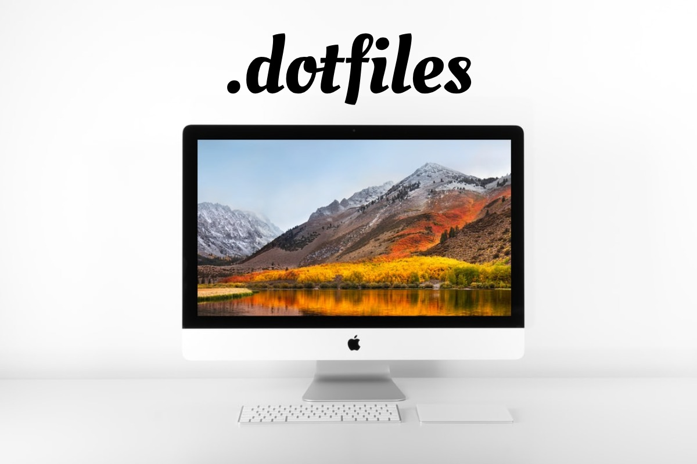

### Installation

Start by installing

* Xcode from  [Xcode Releases](https://xcodereleases.com),
* [Homebrew](brew.sh)

Then clone the repository:

```shell
$ git clone https://github.com/pkrll/Dotfiles
$ mv Dotfiles .dotfiles
```

Run the app installation script:

```bash
$ cd .dotfiles/setup
$ ./install.sh
```

Run the script to symbolically link the dotfiles and preferences files:

```bash
$ cd .dotfiles/setup
$ ./symlink.sh
```
